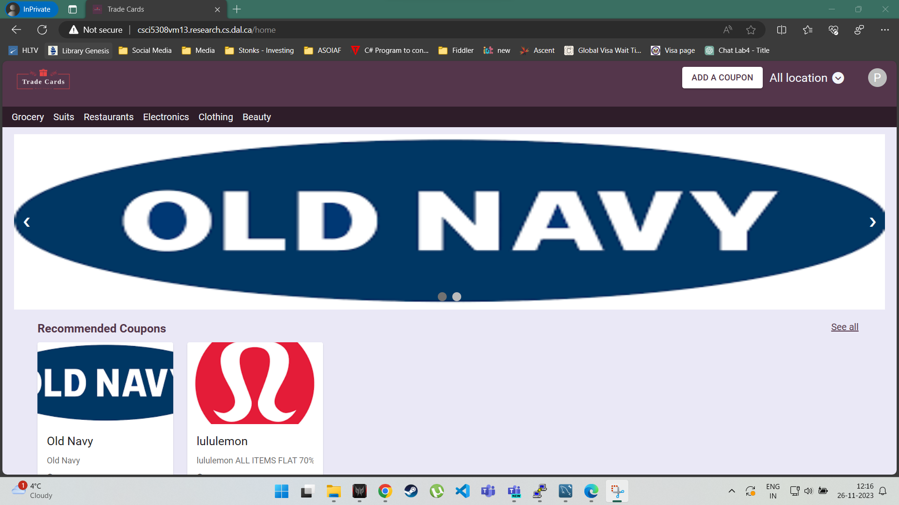
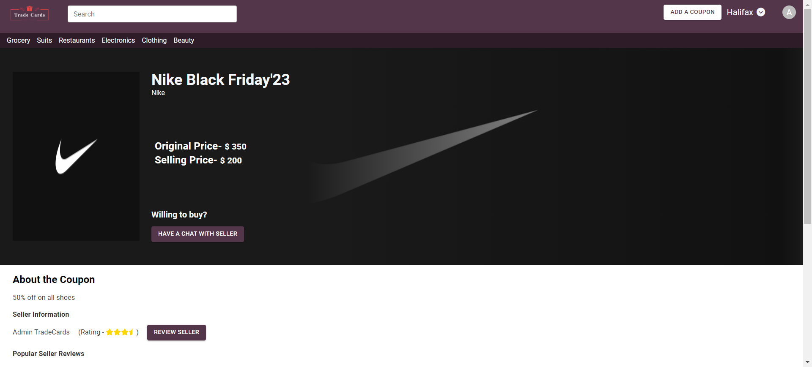
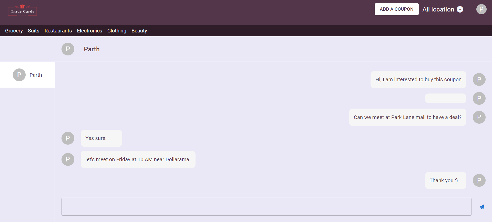
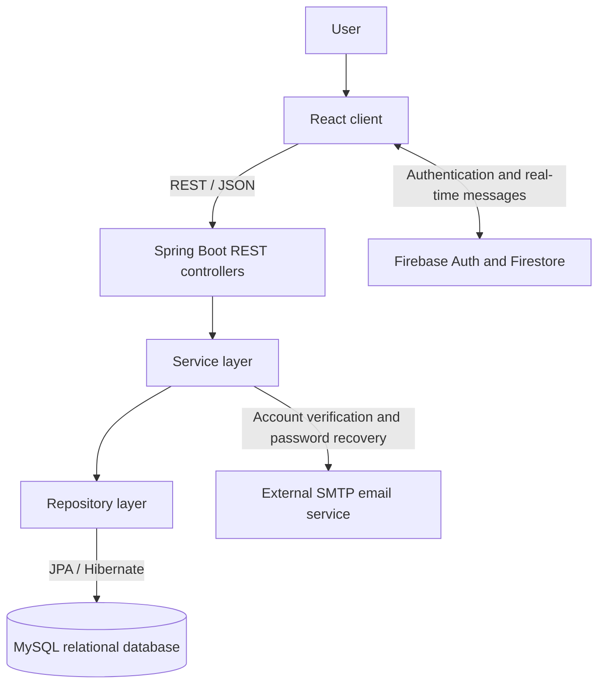

# TradeCards

TradeCards is a marketplace for discovering, listing, and exchanging coupons.
Users can create accounts, publish coupons, browse offers from other users, chat
about a listing, and leave seller reviews after an exchange.

▶ **[Watch the two-minute product walkthrough](docs/walkthrough/tradecards-walkthrough.mp4)**
or [read the accessible transcript](docs/walkthrough/README.md).

## Engineering highlights

- Full-stack monorepo with a React frontend and Java 17 Spring Boot REST API
- JWT-based authentication with registration, account verification, and password
  recovery flows
- Layered backend architecture separating controllers, services, repositories,
  DTOs, and persistence models
- End-to-end marketplace capabilities covering coupon search, listings, seller
  profiles, and reviews
- Real-time user messaging implemented with Firebase Authentication and Firestore
- Automated backend test suite with an isolated in-memory database
- GitLab CI pipeline for repeatable build and test automation
- Documented Designite code-quality analysis comparing architecture, design, and
  implementation smells before and after refactoring

## My contribution — Kabilesh Ravi Chandran

I primarily owned frontend development and integration for TradeCards, alongside
targeted backend, testing, security, and CI contributions:

- Built major React experiences, including navigation and geolocation controls,
  coupon search and listings, coupon details, user profiles, reviews, password
  recovery, loading states, and empty states.
- Implemented the Firebase-backed messaging experience, including seller
  conversations, chat modals, message routes, authorization context, and the
  **My Messages** interface.
- Integrated the frontend with Spring Boot APIs for login, registration, coupon
  discovery, coupon details, profile editing, reviews, and password recovery.
- Contributed to authentication and security integration through login and
  authorization state, Firebase chat authentication, protected interactions, and
  backend CORS/security configuration.
- Contributed coupon retrieval behavior across `CouponsController`,
  `CouponsService`, and its service implementation.
- Added coupon-service tests and helped validate coupon API behavior.
- Configured and iterated on GitLab CI, including automated Designite code-smell
  analysis and before/after code-quality reporting used to assess refactoring.
- Improved usability and visual consistency through location filtering,
  responsive styling, design-system updates, and integration fixes.

## Features

- Account registration, authentication, verification, and password recovery
- Coupon creation, editing, browsing, and seller-specific listings
- Category-based coupon discovery
- Real-time listing conversations powered by Firebase
- Seller profiles and reviews
- Email notifications for account and password-recovery workflows

## Product walkthrough

### 1. Homepage and coupon discovery

Search available offers, filter by category or location, and browse recommended
coupon listings from the marketplace homepage.

<p align="center">
  
</p>
<p align="center"><em>Discover coupons through search, categories, recommendations, and location filters.</em></p>

### 2. Coupon details and reviews

Open a listing to compare its original and selling prices, read its description,
inspect seller information and ratings, or start the seller-review flow.

<p align="center">
  
</p>
<p align="center"><em>Evaluate an offer, review seller reputation, and contact the seller from one screen.</em></p>

### 3. Messaging

Buyers and sellers can continue a listing conversation in the real-time messaging
workspace and coordinate an exchange.

<p align="center">
  
</p>
<p align="center"><em>Real-time buyer–seller messaging keeps coupon exchanges inside the application.</em></p>

### Additional flows

- **Creating a listing:** authenticated sellers can add coupon details, pricing,
  category, location, description, and an image through the listing form.
- **User profile:** users can maintain account details and manage the coupons they
  have posted.
- **Reviews:** buyers can rate sellers from a coupon detail page, while future
  buyers can use seller ratings and reviews when evaluating an offer.

## Technology

TradeCards is organized as a monorepo:

- `frontend/tradecards_ui`: React application
- `backend/tradecards`: Java 17 and Spring Boot REST API
- MySQL for application data
- Firebase Authentication and Firestore for chat

## Architecture



The React client handles marketplace interactions and exchanges JSON with the
Spring Boot controllers. Controllers delegate business rules to services, which
use Spring Data repositories and JPA/Hibernate for relational persistence.
Firebase provides chat authentication and real-time message storage, while the
backend email service sends verification and password-recovery messages through
an externally configured SMTP provider.

## Local development

### Prerequisites

- Java 17
- Node.js 18.18.2 (recorded in `frontend/tradecards_ui/.nvmrc`) and npm
- MySQL 8
- A Firebase web application with Authentication and Firestore enabled
- SMTP credentials for verification and password-recovery email

Confirm the local runtimes before continuing:

```sh
java -version
node --version
npm --version
mysql --version
```

### 1. Create the database

Connect as a MySQL administrator and create a local database and application user:

```sql
CREATE DATABASE tradecards;
CREATE USER 'tradecards'@'localhost' IDENTIFIED BY 'choose-a-local-password';
GRANT ALL PRIVILEGES ON tradecards.* TO 'tradecards'@'localhost';
FLUSH PRIVILEGES;
```

Spring Boot uses Hibernate to create or update the application tables when the
backend starts.

### 2. Configure and run the backend

```sh
cd backend/tradecards
cp .env.example .env
```

Edit `.env` and set all of the following variables:

| Variable | Purpose |
| --- | --- |
| `DATABASE_URL` | MySQL JDBC URL, such as `jdbc:mysql://localhost:3306/tradecards` |
| `DATABASE_USERNAME` | Local MySQL application user |
| `DATABASE_PASSWORD` | Local MySQL application password |
| `JWT_SECRET` | Long, random JWT signing secret (at least 32 bytes) |
| `JWT_EXPIRATION_YEARS` | Token lifetime; defaults to `1` |
| `MAIL_HOST` / `MAIL_PORT` | SMTP server and port |
| `MAIL_USERNAME` / `MAIL_PASSWORD` | SMTP credentials |

Export the file into the current shell and start Spring Boot:

```sh
set -a
source .env
set +a
./mvnw spring-boot:run
```

The API starts on `http://localhost:8080`.

### 3. Configure and run the frontend

In a second terminal, from the repository root:

```sh
cd frontend/tradecards_ui
cp .env.example .env
npm install
npm start
```

Populate `.env` with `REACT_APP_END_POINT=http://localhost:8080` and the Firebase
web configuration values listed in `.env.example`. The React development server
starts on `http://localhost:3000`.

### Seed data and demo account

The repository does not include seed data or public demo credentials. Start both
applications, create an account through the registration screen, and complete
the email-verification flow. This avoids distributing shared passwords and lets
each developer test against isolated local data.

### Tests

Backend tests use the `test` Spring profile and an in-memory H2 database, so MySQL,
Firebase, and SMTP services are not required:

```sh
cd backend/tradecards
./mvnw test
```

Run the frontend test suite in non-interactive mode:

```sh
cd frontend/tradecards_ui
npm install
npm test -- --watchAll=false
```

Do not commit local `.env` files or credentials. See [SECURITY.md](SECURITY.md)
for credential-handling requirements and [CONTRIBUTING.md](CONTRIBUTING.md) for
the project workflow.

## Code-quality reports

Historical Designite reports from before and after refactoring are documented in
[`docs/code-quality`](docs/code-quality/README.md).
